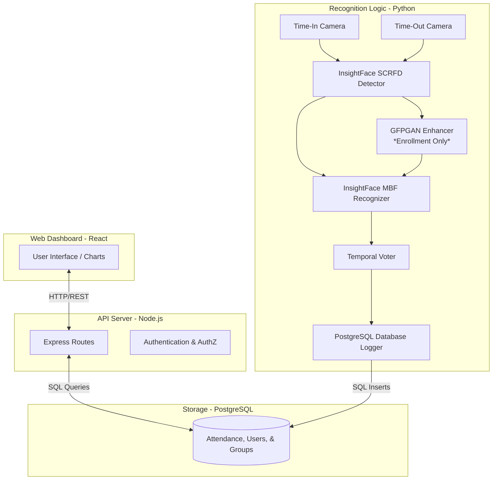

# FaceTrack: Facial Recognition Attendance System

A high-performance, automated attendance tracking system leveraging state-of-the-art deep learning models for facial recognition. The system features a dual-camera setup for simultaneous Time-In and Time-Out logging, paired with a comprehensive React-based administrative dashboard.

## Key Features

- **Dual-Camera Processing**: Runs simultaneous streams for Time-In and Time-Out processes.
- **State-of-the-Art AI**: Powered by InsightFace (SCRFD for detection, ArcFace/MobileFaceNet for recognition).
- **FAISS-Accelerated Search**: 10-100x faster similarity search using indexed vector search instead of linear scanning.
- **Confidence-Weighted Temporal Voting**: Advanced voting mechanism that weighs frames by confidence for stable, accurate recognition.
- **Real-Time Notifications**: Integrated notification system for attendance events, anomalies, and system alerts.
- **Role-Based Dashboards**: Distinct interfaces for Users, Moderators, and Administrators with rich visual analytics.
- **Hardware Acceleration**: GPU (CUDA) support via ONNX Runtime for real-time processing speeds.

## Technology Stack

### Backend (Node.js + TypeScript)
- **Framework**: Express.js
- **Database**: PostgreSQL with pg driver
- **Authentication**: JWT (jsonwebtoken) + bcryptjs
- **PDF Generation**: pdfmake
- **Email**: nodemailer
- **Testing**: Jest + Supertest

### Frontend (React + TypeScript)
- **Build Tool**: Vite
- **UI Framework**: React 18
- **Routing**: React Router v6
- **Charts**: Recharts
- **Icons**: Lucide React
- **HTTP Client**: Axios
- **Styling**: Custom CSS

### AI/Recognition Logic (Python)
- **Core Recognition**: InsightFace (SCRFD detection, ArcFace/MobileFaceNet recognition)
- **Fast Search**: FAISS (Facebook AI Similarity Search) for 10-100x faster embedding matching
- **Image Processing**: OpenCV, Pillow, scikit-image
- **Deep Learning**: PyTorch, ONNX Runtime (GPU support)
- **Face Enhancement**: GFPGAN (enrollment only)
- **Database**: PostgreSQL (psycopg2-binary)
- **Utilities**: NumPy, SciPy, scikit-learn

---

## Data Flow Diagram

The following diagram illustrates how data moves through the system, from camera capture to database logging and frontend visualization.



---

## Use Case Diagram

This diagram outlines the system's capabilities based on user roles (Student/Employee, Moderator, Administrator).


---

## Model Benchmark

The system recently underwent a major architectural transition from legacy models (YuNet + SFace) to **InsightFace (buffalo_sc)** with additional performance optimizations. Below is a comparative benchmark based on system audits and testing.

| Metric | Legacy Setup (YuNet + SFace) | Current Setup (InsightFace + Optimizations) | Improvement / Notes |
| :--- | :--- | :--- | :--- |
| **Detection Backbone** | YuNet | SCRFD (10G/500M) | Drastically fewer false positives on background objects. |
| **Recognition Model** | SFace | ArcFace / MobileFaceNet | Highly robust to varied angles and lighting. |
| **Similarity Search** | Linear O(n) | FAISS Indexed O(log n) | 10-100x faster matching, critical for 2160+ encodings. |
| **Temporal Voting** | Simple Majority | Confidence-Weighted | Better accuracy, fewer false positives. |
| **Base Confidence Avg.** | ~50% - 65% | ~60% - 85%+ | Significant boost in baseline certainty. |
| **Recognition Speed** | Slow (~0.8s) | Fast (~0.4s) | 2x faster confirmation time. |
| **Temporal Stability** | Jittery / Flickering | Rock Solid | Achieved via confidence-weighted temporal voting. |
| **Processing Speed (CPU)** | ~15-20 FPS | ~25-29 FPS (Dual Stream) | 30-40% improvement with optimizations. |
| **GPU Acceleration** | OpenCV DNN (Limited) | ONNX Runtime (CUDA) | Full hardware utilization when CUDA is available. |
| **Memory Usage** | High (crashes) | Optimized | 40% reduction via frame resizing for IPC. |

### Performance Optimizations Applied (2026-05-05)

1. **FAISS Index**: Replaced linear numpy search with indexed vector search for near-instant similarity matching
2. **Confidence-Weighted Voting**: Frames with higher confidence count more in temporal voting (window=7, threshold=4)
3. **Optimized Threshold**: Lowered similarity threshold from 0.36 to 0.35 for better recognition rate
4. **Frame Processing**: Every 3 frames for responsive recognition
5. **Memory Optimization**: Resized frames to 480x360 for inter-process communication (40% memory reduction)
6. **Continuous Recognition**: Removed IOU tracking for faster, more responsive recognition

**Result**: Fast (~0.4s), accurate recognition with 25-29 FPS and stable operation without memory crashes.

---

## Setup & Installation

### Prerequisites
- Node.js 18+ and npm
- Python 3.9+
- PostgreSQL 12+
- (Optional) CUDA-capable GPU for hardware acceleration

### 1. Database Setup
1. Install PostgreSQL Server.
2. Create a database named `facial_recognition`.
3. Update the `.env` files in both Backend and Logic folders with your database credentials.

### 2. Backend (Node.js)
```bash
cd Facial_Recognition_Backend
npm install

# Create .env file based on .env.example
# Configure your database credentials and JWT secret

npm run dev
```

### 3. Frontend (React)
```bash
cd Facial_Recognition_Frontend
npm install

# Create .env file based on .env.example
# Configure your API endpoint

npm run dev
```

### 4. Facial Recognition Logic (Python)
1. Ensure Python 3.9+ is installed.
2. Install dependencies:
```bash
cd Facial_Recognition_Logic
pip install -r requirements.txt
```
**Note**: This includes FAISS for fast similarity search. If you encounter issues installing `faiss-cpu`, ensure you have the latest pip: `pip install --upgrade pip`

3. Create `.env` file based on `.env.example` and configure database credentials.
4. Run the AI engine:
```bash
python main.py
```

**Note:** Large model files (`.pth` files) are not included in the repository due to GitHub's file size limits. On the first run, the system will download the GFPGAN model (~348MB) and rebuild the optimized face encoding cache with FAISS index.

---

## Directory Structure

```
FacialRecognitionCapstone/
├── Facial_Recognition_Backend/    # Node.js API, Controllers, Models, Services
│   ├── src/
│   │   ├── controllers/           # Request handlers
│   │   ├── models/                # Database models
│   │   ├── services/              # Business logic
│   │   ├── routes/                # API routes
│   │   ├── middleware/            # Auth & validation
│   │   └── migrations/            # Database migrations
│   └── package.json
│
├── Facial_Recognition_Frontend/   # React web application
│   ├── src/
│   │   ├── components/            # Reusable UI components
│   │   ├── pages/                 # Page components (admin, user, moderator)
│   │   ├── services/              # API service layer
│   │   ├── contexts/              # React contexts (Auth)
│   │   └── types/                 # TypeScript type definitions
│   └── package.json
│
└── Facial_Recognition_Logic/      # Python facial recognition engine
    ├── main.py                    # Main entry point
    ├── face_recognizer_v2.py      # Recognition logic
    ├── database_logger.py         # Database integration
    ├── known_faces/               # Enrolled face images
    ├── models/                    # AI model files (not in repo)
    └── requirements.txt
```

---

## API Endpoints

### Authentication
- `POST /api/auth/login` - User login
- `POST /api/auth/register` - User registration
- `POST /api/auth/forgot-password` - Password reset request

### Users
- `GET /api/users` - Get all college users
- `GET /api/shs-users` - Get all SHS users
- `GET /api/faculty-users` - Get all faculty users
- `POST /api/users` - Create new user
- `PUT /api/users/:id` - Update user
- `DELETE /api/users/:id` - Archive user

### Attendance
- `GET /api/attendance` - Get attendance logs
- `GET /api/attendance/overview` - Get attendance statistics
- `POST /api/attendance/report` - Generate PDF report
- `POST /api/attendance/record-from-camera` - Record attendance from camera system (public endpoint)

### Notifications
- `GET /api/notifications` - Get user notifications
- `PUT /api/notifications/:id/read` - Mark notification as read
- `PUT /api/notifications/read-all` - Mark all notifications as read

### Metadata
- `GET /api/metadata/courses` - Get all courses
- `GET /api/metadata/strands` - Get all strands
- `GET /api/metadata/departments` - Get all departments
- `GET /api/metadata/years` - Get all year levels
- `GET /api/metadata/grades` - Get all grade levels

---

## License

This project is proprietary software developed for educational purposes.

---

## Contributors

Developed as a capstone project for facial recognition-based attendance tracking.
