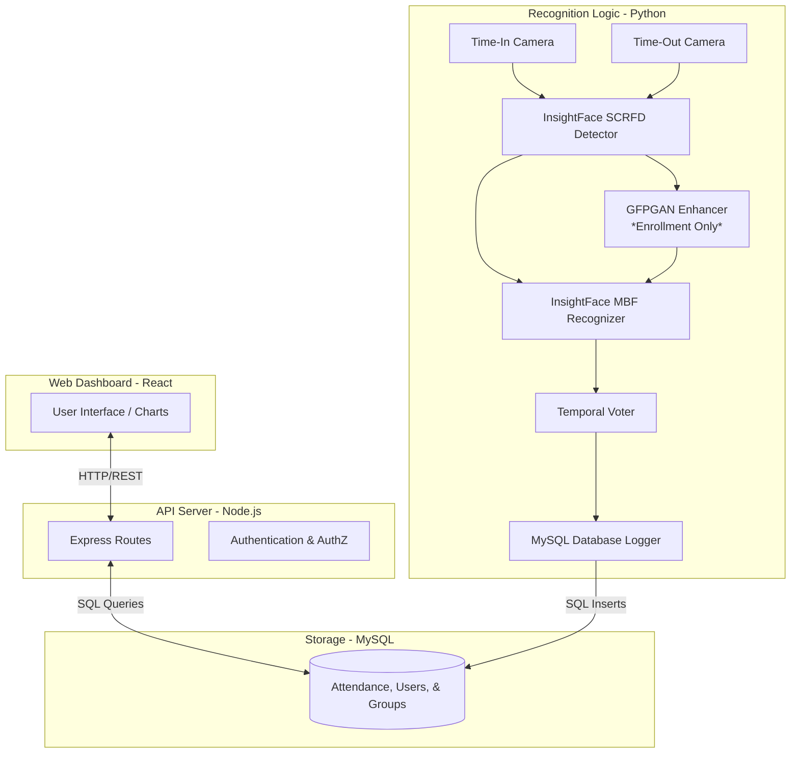
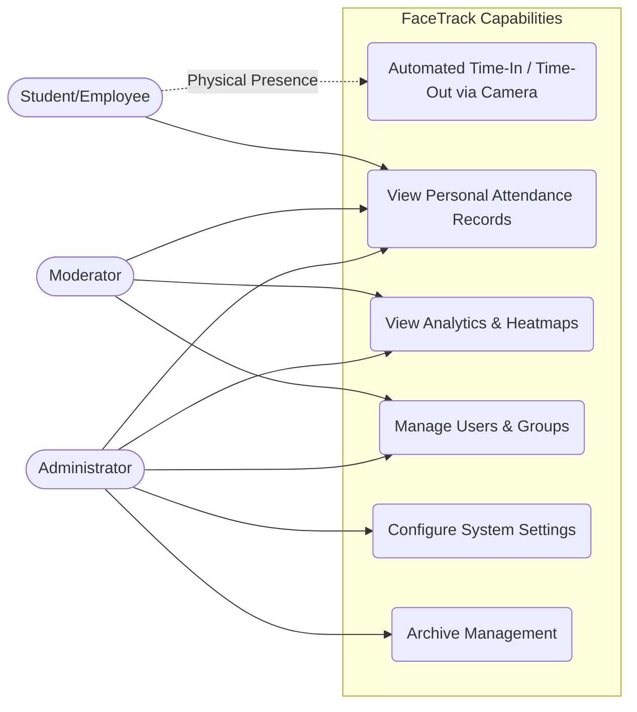

# FaceTrack: Optimized Facial Recognition Attendance System

A high-performance, automated attendance tracking system leveraging state-of-the-art deep learning models for facial recognition. The system features a dual-camera setup for simultaneous Time-In and Time-Out logging, paired with a comprehensive React-based administrative dashboard.

## 🚀 Key Features

*   **Dual-Camera Processing**: Runs simultaneous streams for Time-In and Time-Out processes.
*   **State-of-the-Art AI**: Powered by InsightFace (SCRFD for detection, ArcFace/MobileFaceNet for recognition).
*   **Temporal Identity Stabilization**: Uses a temporal voting mechanism across consecutive frames to prevent false positives and stabilize recognition.
*   **GFPGAN Face Enhancement**: Automatically enhances blurry enrollment images to extract higher-quality embeddings.
*   **Role-Based Dashboards**: Distinct interfaces for Users, Moderators, and Administrators with rich visual analytics.
*   **Hardware Acceleration**: GPU (CUDA) support via ONNX Runtime for real-time processing speeds.

## 🛠️ Technology Stack

*   **AI/Logic (Python)**: InsightFace, OpenCV, PyTorch, GFPGAN, ONNX Runtime
*   **Backend (Node.js)**: Express.js, TypeScript, Sequelize (ORM)
*   **Frontend (React)**: Vite, TypeScript, TailwindCSS/Custom CSS, Lucide Icons
*   **Database**: MySQL

---

## 📊 Data Flow Diagram

The following diagram illustrates how data moves through the system, from camera capture to database logging and frontend visualization.



---

## 👤 Use Case Diagram

This diagram outlines the system's capabilities based on user roles (Student/Employee, Moderator, Administrator).



---

## 📈 Model Benchmark

The system recently underwent a major architectural transition from legacy models (YuNet + SFace) to **InsightFace (buffalo_sc)**. Below is a comparative benchmark based on system audits and testing.

| Metric | Legacy Setup (YuNet + SFace) | Optimized Setup (InsightFace) | Improvement / Notes |
| :--- | :--- | :--- | :--- |
| **Detection Backbone** | YuNet | SCRFD (10G/500M) | Drastically fewer false positives on background objects. |
| **Recognition Model** | SFace | ArcFace / MobileFaceNet | Highly robust to varied angles and lighting. |
| **Base Confidence Avg.** | ~50% - 65% | ~60% - 85%+ | Significant boost in baseline certainty. |
| **Blur Tolerance** | Very Poor | Excellent | Supported by **GFPGAN** preprocessing for blurry enrollment photos. |
| **Temporal Stability** | Jittery / Flickering | Rock Solid | Achieved via a sliding-window Temporal Voter algorithm. |
| **Processing Speed (CPU)** | ~15-20 FPS | ~20 FPS (Dual Stream) | Maintained real-time speed while using heavier, more accurate models. |
| **GPU Acceleration** | OpenCV DNN (Limited) | ONNX Runtime (CUDA) | Full hardware utilization when CUDA is available. |

---

## ⚙️ Setup & Installation

### 1. Database Setup
1. Install MySQL Server.
2. Create a database named `facial_recognition`.
3. Import the base schema (if provided) or allow Sequelize to auto-sync.

### 2. Backend (Node.js)
```bash
cd Facial_Recognition_Backend
npm install
# Configure your .env file with DB credentials
npm run dev
```

### 3. Frontend (React)
```bash
cd Facial_Recognition_Frontend
npm install
npm run dev
```

### 4. Facial Recognition Logic (Python)
1. Ensure Python 3.9+ is installed.
2. Install dependencies:
```bash
cd Facial_Recognition_Logic
pip install -r requirements.txt
```
3. Run the AI engine:
```bash
python main.py
```
*(Note: On the first run, the system will download the GFPGAN model (~348MB) and rebuild the optimized face encoding cache.)*

## 📁 Directory Structure
*   `/Facial_Recognition_Backend` - Node.js API, Models, and Controllers.
*   `/Facial_Recognition_Frontend` - Vite/React web application.
*   `/Facial_Recognition_Logic` - Python dual-camera scripts, InsightFace integration, and cache.
